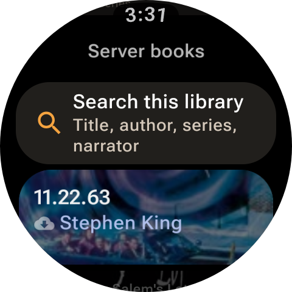
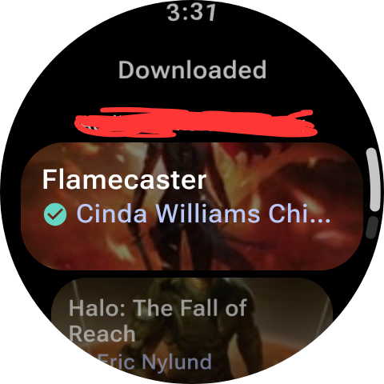

# NortlinOS

**Your Audiobookshelf library, on your wrist.**

NortlinOS is an audiobook and podcast player for Wear OS watches that connects to your own
[Audiobookshelf](https://www.audiobookshelf.org/) server. Download books to the watch, leave your
phone at home, and pick up exactly where you left off on any device.

## What you can do

- **Browse and search your library** with the crown or a swipe. Books appear as cards with their
  cover art. Switch to **Series** to group books together, search series by name, title, author, or
  narrator, open a series, and queue all its books
  for download at once. Books already downloaded or downloading are left alone.
- **Podcasts have their own section** on the home screen, separate from your book library. Browse
  podcast libraries and shows, then open an episode to play it or download it for offline
  listening. Show and episode details are read from the on-watch library cache first and refreshed
  from your server when connected. Podcast episodes have their own download and listening
  progress, and use the same player controls as books: skip, chapter navigation when available,
  playback speed, volume, and a sleep timer. Download or delete all episodes in a show together;
  NortlinOS checks the watch's free space against Audiobookshelf's episode-size estimates and
  warns before queueing if the show may not fit or some sizes are unknown.
- **Download books to the watch** and listen with no phone or internet connection. Press and hold
  a book's tile in a library, series, or search list to start (or pause) its download right there,
  or open the book's page for full download controls. Downloads can be paused, resumed, cancelled,
  or deleted, and an interrupted download continues where it stopped.
- **Stream** books you haven't downloaded when the watch is online.
- **Recent books.** The main menu lists your 10 most recently played unfinished books. Tap one to
  open its book page, where you can play it or download it first.
  A **Now playing** shortcut sits at the top of the main menu while a book is loaded.
- **Add the Now playing tile** (swipe left from the watch face to the end of your tiles, tap **+**,
  and pick NortlinOS *Now playing*).
  It shows your current book over its cover and how much is left. While a book plays, **Pause**
  stops it right from the tile; when paused, **Resume** opens the player and carries on (so
  NortlinOS can check for headphones first).
- **No accidental speaker playback.** If you press play without headphones connected, NortlinOS
  asks first: tap **Connect headphones** to open the watch's audio output screen (playback starts
  by itself once they connect), or **Use watch speaker** if your watch has one.
- **Control playback** from a simple player: play/pause and 30-second skip back/forward. Turn the
  **crown to change the volume**. On round watches a ring around the edge shows how far through
  the book you are, with a small gap between chapters.
- **Swipe left on the player** for extra tools (the dots at the bottom show which page you're on):
  - previous/next chapter, or All chapters to jump straight to any chapter;
  - a sleep timer (any length up to 12 hours);
  - playback speed;
  - **Bookmark this spot** to save the current position (books only), then **View bookmarks** to
    jump back to any saved spot or hold one to remove it.
- **Keep your place everywhere.** Book and podcast episode progress syncs with your server
  automatically, so the phone app, the web player and the watch agree. If the watch and another
  device both moved on while out of touch, NortlinOS asks which position to keep instead of
  guessing.
- **See the cover in the watch's media controls**, so you can pause from anywhere.
- **Show progress for the whole book or the current chapter** (Settings).
- **Tailor the app to how you listen** (Settings): **Show series** opens libraries in the Series
  view every time, and **Search on main menu** hides the Search entry if you never use it.
- **Keep listening after signing out.** *Listen offline* on the sign-in screen opens your
  downloads without an account.

## Podcasts

Tap **Podcasts** on the home screen to browse podcast libraries and shows separately from your
books. Open a show to browse its episodes.

On a show's episode list, each episode is a single tile:

- **Tap an episode** to open its episode page: description, **Play or resume**, and full download
  controls (download, pause, resume, cancel, or delete).
- **Press and hold an episode** to start downloading it right from the list, without leaving the
  list — no need to open the episode first. Holding again while it's downloading pauses it. Holding
  an episode that's already downloaded does nothing there; manage or delete it from the episode
  page instead.
- **The tile's color shows its download state at a glance:** dark gray with white text and an
  orange download icon means the episode isn't downloaded yet (or is queued, downloading, paused,
  or failed); orange with black text and a green check means it's downloaded and ready to play
  offline.

Playback uses the same player controls as books, including skip controls, playback speed, volume,
and the sleep timer. Episode listening progress syncs independently with Audiobookshelf.

Show details and episode lists are cached on the watch and can be browsed offline after they have
been loaded once while connected. To listen offline, download each episode first; streaming an
episode does not save its audio automatically. On a show's page, **Download all episodes** queues
the episodes that are not already downloaded or in progress. Before queueing, NortlinOS compares
estimated episode sizes with free watch storage and warns if the series may not fit or any episode
size is unknown. You can continue anyway if you choose. **Delete all episode downloads** removes
the downloaded episodes for that show from the watch.

### Screenshots

<table>
  <tr>
    <td align="center"><br />Home menu and connection status</td>
    <td align="center"><br />More home menu options</td>
  </tr>
  <tr>
    <td align="center"><br />Search and browse a library</td>
    <td align="center"><br />Book details and playback options</td>
  </tr>
  <tr>
    <td align="center"><br />Download and book description</td>
    <td align="center"><br />Player controls and book progress</td>
  </tr>
</table>

## Requirements

- A watch running **Wear OS 4 or newer** (for example Pixel Watch 2+, Galaxy Watch 6+).
- An **Audiobookshelf server** you can reach from the watch, on your home network or the internet.
- **Bluetooth headphones** are recommended. The watch speaker works if your watch has one.

## Installing

NortlinOS isn't on the Play Store yet. It's installed from a file:

1. Download the latest `NortlinOS-x.y.z.apk` from this repository's **Releases** page.
2. On the watch, enable **Developer options** (Settings → System → About → tap *Build number*
   seven times). Then turn on **ADB debugging** and **Debug over Wi-Fi** (or **Wireless
   debugging**).
3. On a computer with [Android platform tools](https://developer.android.com/tools/releases/platform-tools)
   on the same Wi-Fi network, connect to the address the watch shows, then install:

   ```bash
   adb connect <watch-ip>:<port>      # newer watches: run `adb pair` first
   adb install -r NortlinOS-x.y.z.apk
   ```

To update, repeat step 3 with the new file. `-r` keeps your sign-in, downloads and progress.

## Signing in

**You must sign in seperately from the app on your phone, they do not share login information**

<p align="center">
  
</p>

1. Open NortlinOS and enter your **server address**, e.g. `https://abs.example.com` or
   `192.168.1.20:13378`. If you leave out `https://`, NortlinOS tries a secure connection first.
2. Enter your **username and password** and tap **Sign in**.

**Single sign-on (SSO):** if your server has OpenID Connect enabled, a sign-in button for it
appears as soon as you enter the address. The sign-in page opens on your **paired phone**.
For that to work, your server administrator needs to add this address under **Settings →
Authentication → Allowed Mobile Redirect URIs** in Audiobookshelf:

```
https://wear.googleapis.com/3p_auth/com.nortlinos.wearos
```

If the watch itself has a browser, SSO also works there without that setting.

You stay signed in. NortlinOS automatically restores your session when the watch reconnects to a
network. On Audiobookshelf 2.26 and newer, it first renews expired sessions with the server; if
needed, it can reauthenticate with the credentials from password sign-in.

## Listening offline

Open a book and tap **Download for offline**, or tap **Download for offline** under an episode in
the Podcasts section. Audio and available cover art are saved on the watch; show and episode
details remain in the library cache. If you stay on a book's page, a full-screen check mark tells you when its download finishes
(or fails, or is deleted). **Downloaded** on the main menu lists content stored on the watch, and
Settings shows how much space downloads use and how much is free. Downloads use Wi-Fi or your
phone's connection and continue in the background.

Podcast shows and episode details that have been loaded from the server stay cached for offline
browsing. To listen offline, download each episode first; a streamed episode is not automatically
saved. Completed episode downloads play without a server connection, and each episode keeps its
own resume position.

Progress you make offline is saved on the watch and sent to your server the next time the watch
is connected, either via Wi-Fi or through your phone's connection.

<p align="center">
  
</p>

## Battery

NortlinOS is built to be light on battery during long listening sessions:

- When the watch has no connection, it doesn't try to reach the server.
- Streaming fetches audio a few minutes ahead in large bursts so the radio can switch off in between.
- Where the watch supports it, audio decoding is handed to dedicated low-power hardware.
- Nothing updates on screen while the screen is off. In always-on mode the player turns
  almost entirely black.
- Covers are downloaded once at watch size and then reused.
- The tile only updates when you play or pause; it never wakes the watch on a schedule.

For the longest battery life, download books and podcast episodes ahead of time instead of
streaming them.

## Troubleshooting

| Problem | Try |
|---|---|
| "Offline", "No network connection" or "Unable to connect" | Check the watch is on Wi-Fi or connected to your phone, and that the address works from a phone on the same network. |
| A podcast show has no episodes while offline | Open the show while connected first so its episode list can be cached. Download episodes you want to listen to offline. |
| SSO button doesn't appear | OpenID Connect isn't enabled on the server. Use your username and password. |
| SSO opens but never returns | Ask your admin to add the redirect address above to the server's allow list. |
| A book or podcast episode won't play | If it isn't downloaded, the watch needs a connection to stream it. |
| A cover changed on the server but not on the watch | Covers are cached. Clear the app's cache in the watch's settings. |
| "Progress differs" appears | Another device saved newer progress while the watch had unsynced listening. Pick the position you want to keep. |
| No sound | Connect Bluetooth headphones, or turn the crown on the player to raise the volume. If you chose *Use watch speaker*, that choice lasts until NortlinOS is closed. |
| "No headphones" appears even though they're paired | Make sure they are turned on and connected to the watch (not only to your phone), then tap **Connect headphones**. |
| The tile says "Start a book to resume it from here" | Play any book once; the tile remembers it from then on. |

## Roadmap

Improvements being worked on:

- Power efficiency improvements
- UI smoothness updates
- Updates to the harness to help handle future Audiobookshelf API updates gracefully

## Privacy

NortlinOS talks only to the Audiobookshelf server you sign in to. Your session and (for password
sign-in) your credentials are stored encrypted on the watch and are never included in backups.
There are no ads, analytics, or third-party services.

## License

NortlinOS is released under the terms of the [license](LICENSE) included in this repository.
